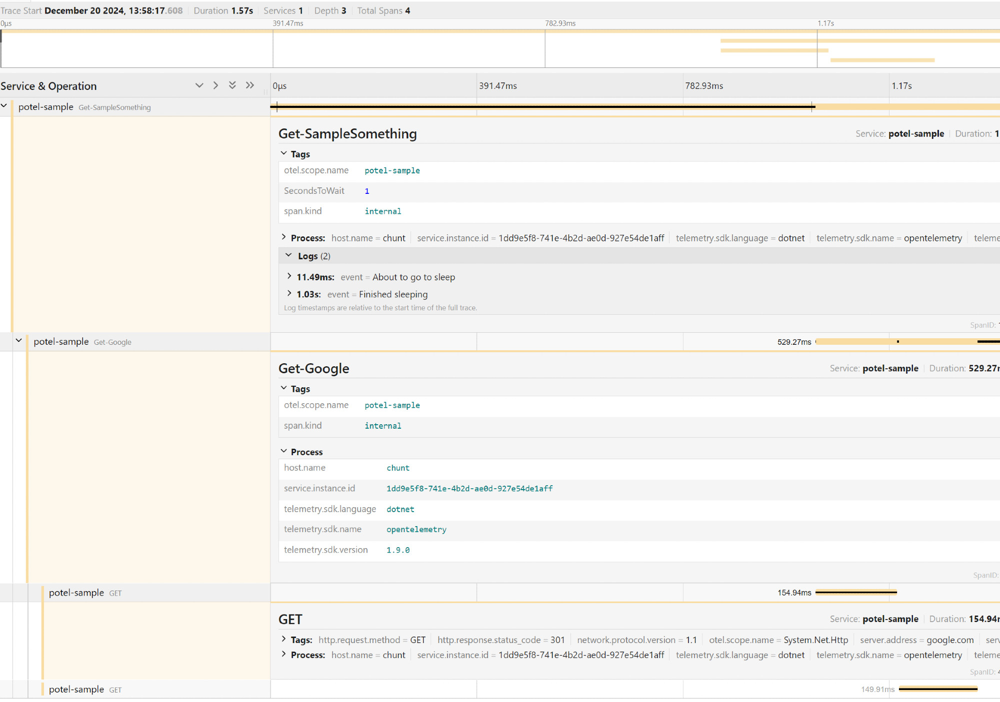

# Sample.psm1

This ia a overly simplified sample module used to explain some of the basic functionality of **potel**.

This sample assume you have a local instance of Jaeger running to receive trace data. You can start up a server with the following Docker command.

```powershell
docker run --rm --name jaeger `
  -p 16686:16686 `
  -p 4317:4317 `
  -p 4318:4318 `
  -p 5778:5778 `
  -p 9411:9411 `
  jaegertracing/jaeger:2.1.0
```

## Terminology

Here are some terms as documented at [opentelemetry.io/docs/concepts/signals/traces](https://opentelemetry.io/docs/concepts/signals/traces/) and [opentelemetry.io/docs/languages/net/instrumentation/#a-note-on-terminology](https://opentelemetry.io/docs/languages/net/instrumentation/#a-note-on-terminology).

### Tracer

A Tracer creates spans containing more information about what is happening for a given operation, such as a request in a service. Tracers are created from Tracer Providers.

### Tracer Provider

A Tracer Provider is a factory for Tracers. In most applications, a Tracer Provider is initialized once and its lifecycle matches the application's lifecycle.

PowerShell modules and cmdlets don't seamlessly line up with the typical Tracer lifecycle. More on that later.

### Activities (aka Spans)

A span represents a unit of work or operation. Spans are the building blocks of Traces.

### Activity Events (aka Span Events)

An Activity Event can be thought of as a structured log message on an Activity, typically used to denote a meaningful, singular point in time during the Activity's duration.

### Resources

A Resource represents the entity producing telemetry as resource attributes. The `$env:OTEL_RESOURCE_ATTRIBUTES` environment variable can also be used to inject resources into your application.

## How it works

### Set up the Tracer

The Sample module creates a Tracer in manifest using the Service Name `potel-sample`. The Service Name is the top most pieces of metadata and should not change if you want to compare traces across time. It also defines an Activity Source named `potel-sample`. The Activity Source and Service Name do not need to be the same. Along with the Service Name, we add a `host.name` Resource Attribute. You can find an Attribute Registry at [opentelemetry.io/docs/specs/semconv/attributes-registry](https://opentelemetry.io/docs/specs/semconv/attributes-registry/).

We attach two Exporters - OtlpTrace and Console. All activities will be sent to both Exporters. The OtlpTrace exporter will send data to Jaeger in this instance and the Console exporter will write output to StdOut.

This sample also uses the [Zero-code instrumentation](https://opentelemetry.io/docs/concepts/instrumentation/zero-code/) for `System.Net.Http.HttPClient` which will automatically create Activities when methods of `HttPClient` are invoked.

The Tracer exists globally in the PowerShell session in the current version of **potel**. This brings with it some considerations. The `HttPClient` instrumentation will record every instance of `HttPClient` for any process within PowerShell. Filtering has not yet been implemented. It will also continue to generate new Activities/Spans until `Stop-Tracer` is called or the PowerShell process is stopped.

```powershell
$activitySource = New-ActivitySource -Name potel-sample
New-TracerProviderBuilder |
Add-TracerSource -ActivitySource $activitySource |
Add-ResourceConfiguration -ServiceName potel-sample -Attribute @{"host.name" = 'chunt' } |
Add-HttpClientInstrumentation |
Add-ExporterOtlpTrace -Endpoint http://localhost:4317 |
Add-ExporterConsole |
Start-Tracer
```

### Record an Activity

`Start-Activity` will create a new Activity instance from the given Activity Source. Remember that the Activity Source is what routes Activities to Tracers and the Exporters.

```powershell
$activity = $activitySource | Start-Activity -Name "Get-SampleSomething"
```

If you create a new Activity while another Activity instance is still in scope you will create a nested Activity.

### Example output

Here is what the data in looks like in Jaeger when you import the module `sample.psm1` and invoke `Get-SampleSomething`.



You see three nested spans: `Get-SampleSomething` calls `Get-Google` which makes an Http Get request to google.com. Within `Get-SampleSomething` you can see the two Events logged and all three spans include the resource attribute `host.name = chunt`.

With HttpClientInstrumentation the Get request will include a standard `traceid` header and if that request hits a service that is also reporting Otel traces to the same Exporter you should be able to follow the Distributed Trace across multiple services.
